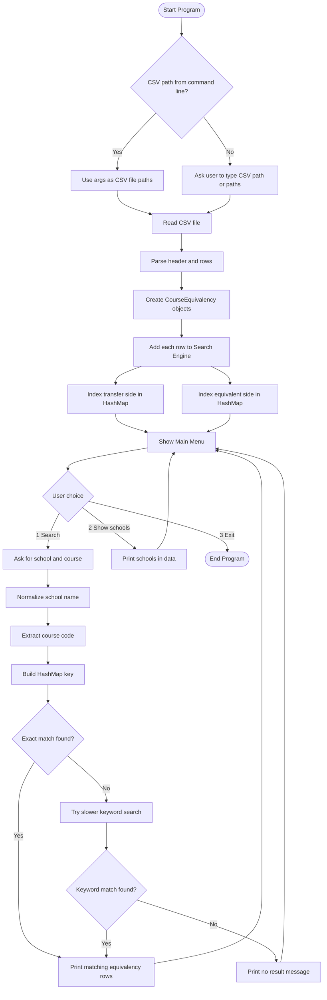

# Flowchart

可以把下面 Mermaid 代码复制到 Markdown preview、Mermaid Live Editor 或支持 Mermaid 的编辑器里查看图形。

```mermaid
flowchart TD
    A([Start Program]) --> B{CSV path from command line?}

    B -- Yes --> C[Use args as CSV file paths]
    B -- No --> D[Ask user to type CSV path or paths]

    C --> E[Read CSV file]
    D --> E

    E --> F[Parse header and rows]
    F --> G[Create CourseEquivalency objects]
    G --> H[Add each row to Search Engine]

    H --> I[Index transfer side in HashMap]
    H --> J[Index equivalent side in HashMap]

    I --> K[Show Main Menu]
    J --> K

    K --> L{User choice}

    L -- 1 Search --> M[Ask for school and course]
    M --> N[Normalize school name]
    N --> O[Extract course code]
    O --> P[Build HashMap key]
    P --> Q{Exact match found?}

    Q -- Yes --> R[Print matching equivalency rows]
    Q -- No --> S[Try slower keyword search]
    S --> T{Keyword match found?}
    T -- Yes --> R
    T -- No --> U[Print no result message]

    R --> K
    U --> K

    L -- 2 Show schools --> V[Print schools in data]
    V --> K

    L -- 3 Exit --> W([End Program])
```
