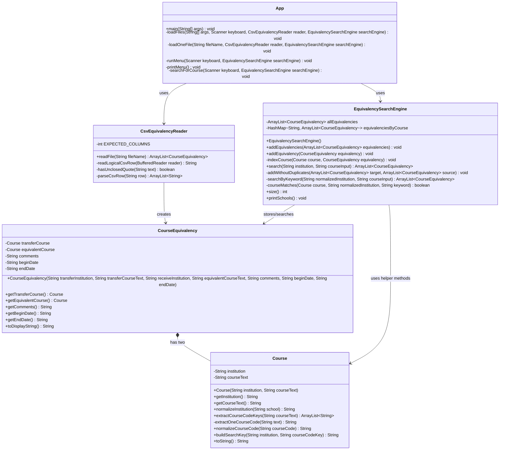

# UML Class Diagram

```mermaid
classDiagram
    class App {
        +main(String[] args) void
        -loadFiles(String[] args, Scanner keyboard, CsvEquivalencyReader reader, EquivalencySearchEngine searchEngine) void
        -loadOneFile(String fileName, CsvEquivalencyReader reader, EquivalencySearchEngine searchEngine) void
        -runMenu(Scanner keyboard, EquivalencySearchEngine searchEngine) void
        -printMenu() void
        -searchForCourse(Scanner keyboard, EquivalencySearchEngine searchEngine) void
    }

    class Course {
        -String institution
        -String courseText
        +Course(String institution, String courseText)
        +getInstitution() String
        +getCourseText() String
        +normalizeInstitution(String school) String
        +extractCourseCodeKeys(String courseText) ArrayList~String~
        -extractOneCourseCode(String text) String
        +normalizeCourseCode(String courseCode) String
        +buildSearchKey(String institution, String courseCodeKey) String
        +toString() String
    }

    class CourseEquivalency {
        -Course transferCourse
        -Course equivalentCourse
        -String comments
        -String beginDate
        -String endDate
        +CourseEquivalency(String transferInstitution, String transferCourseText, String receiveInstitution, String equivalentCourseText, String comments, String beginDate, String endDate)
        +getTransferCourse() Course
        +getEquivalentCourse() Course
        +getComments() String
        +getBeginDate() String
        +getEndDate() String
        +toDisplayString() String
    }

    class CsvEquivalencyReader {
        -int EXPECTED_COLUMNS
        +readFile(String fileName) ArrayList~CourseEquivalency~
        -readLogicalCsvRow(BufferedReader reader) String
        -hasUnclosedQuote(String text) boolean
        -parseCsvRow(String row) ArrayList~String~
    }

    class EquivalencySearchEngine {
        -ArrayList~CourseEquivalency~ allEquivalencies
        -HashMap~String, ArrayList~CourseEquivalency~~ equivalenciesByCourse
        +EquivalencySearchEngine()
        +addEquivalencies(ArrayList~CourseEquivalency~ equivalencies) void
        +addEquivalency(CourseEquivalency equivalency) void
        -indexCourse(Course course, CourseEquivalency equivalency) void
        +search(String institution, String courseInput) ArrayList~CourseEquivalency~
        -addWithoutDuplicates(ArrayList~CourseEquivalency~ target, ArrayList~CourseEquivalency~ source) void
        -searchByKeyword(String normalizedInstitution, String courseInput) ArrayList~CourseEquivalency~
        -courseMatches(Course course, String normalizedInstitution, String keyword) boolean
        +size() int
        +printSchools() void
    }

    App --> CsvEquivalencyReader : uses
    App --> EquivalencySearchEngine : uses
    CsvEquivalencyReader --> CourseEquivalency : creates
    CourseEquivalency *-- Course : has two
    EquivalencySearchEngine --> CourseEquivalency : stores/searches
    EquivalencySearchEngine --> Course : uses helper methods
```
