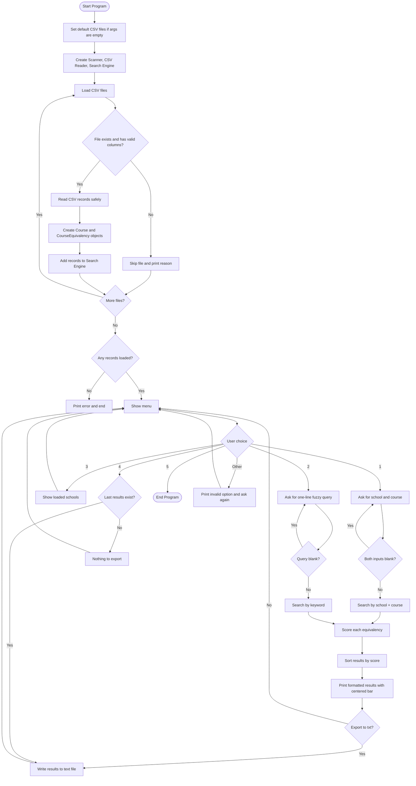

# Flowchart

```mermaid
flowchart TD
    A([Start Program]) --> B[Set default CSV files if args are empty]
    B --> C[Create Scanner, CSV Reader, Search Engine]
    C --> D[Load CSV files]
    D --> E{File exists and has valid columns?}
    E -- Yes --> F[Read CSV records safely]
    E -- No --> G[Skip file and print reason]
    F --> H[Create Course and CourseEquivalency objects]
    H --> I[Add records to Search Engine]
    G --> J{More files?}
    I --> J
    J -- Yes --> D
    J -- No --> K{Any records loaded?}
    K -- No --> L[Print error and end]
    K -- Yes --> M[Show menu]

    M --> N{User choice}
    N -- 1 --> O[Ask for school and course]
    O --> P{Both inputs blank?}
    P -- Yes --> O
    P -- No --> Q[Search by school + course]

    N -- 2 --> R[Ask for one-line fuzzy query]
    R --> S{Query blank?}
    S -- Yes --> R
    S -- No --> T[Search by keyword]

    Q --> U[Score each equivalency]
    T --> U
    U --> V[Sort results by score]
    V --> W[Print formatted results with centered bar]
    W --> X{Export to txt?}
    X -- Yes --> Y[Write results to text file]
    X -- No --> M
    Y --> M

    N -- 3 --> Z[Show loaded schools]
    Z --> M
    N -- 4 --> AA{Last results exist?}
    AA -- Yes --> Y
    AA -- No --> AB[Nothing to export]
    AB --> M
    N -- 5 --> AC([End Program])
    N -- Other --> AD[Print invalid option and ask again]
    AD --> M
```
