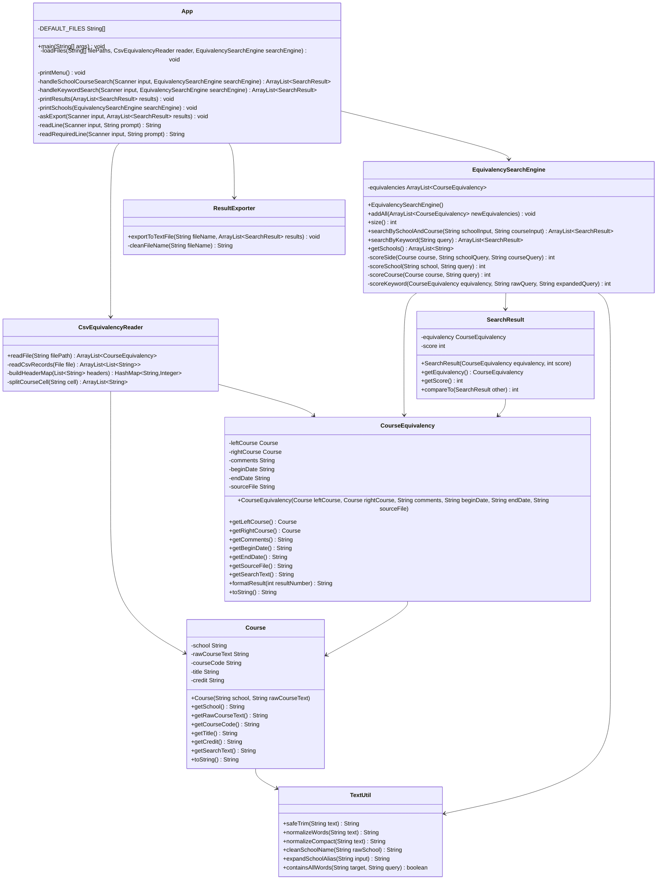

# UML Class Diagram

```mermaid
classDiagram
    class App {
        -DEFAULT_FILES String[]
        +main(String[] args) void
        -loadFiles(String[] filePaths, CsvEquivalencyReader reader, EquivalencySearchEngine searchEngine) void
        -printMenu() void
        -handleSchoolCourseSearch(Scanner input, EquivalencySearchEngine searchEngine) ArrayList~SearchResult~
        -handleKeywordSearch(Scanner input, EquivalencySearchEngine searchEngine) ArrayList~SearchResult~
        -printResults(ArrayList~SearchResult~ results) void
        -printSchools(EquivalencySearchEngine searchEngine) void
        -askExport(Scanner input, ArrayList~SearchResult~ results) void
        -readLine(Scanner input, String prompt) String
        -readRequiredLine(Scanner input, String prompt) String
    }

    class Course {
        -school String
        -rawCourseText String
        -courseCode String
        -title String
        -credit String
        +Course(String school, String rawCourseText)
        +getSchool() String
        +getRawCourseText() String
        +getCourseCode() String
        +getTitle() String
        +getCredit() String
        +getSearchText() String
        +toString() String
    }

    class CourseEquivalency {
        -leftCourse Course
        -rightCourse Course
        -comments String
        -beginDate String
        -endDate String
        -sourceFile String
        +CourseEquivalency(Course leftCourse, Course rightCourse, String comments, String beginDate, String endDate, String sourceFile)
        +getLeftCourse() Course
        +getRightCourse() Course
        +getComments() String
        +getBeginDate() String
        +getEndDate() String
        +getSourceFile() String
        +getSearchText() String
        +formatResult(int resultNumber) String
        +toString() String
    }

    class CsvEquivalencyReader {
        +readFile(String filePath) ArrayList~CourseEquivalency~
        -readCsvRecords(File file) ArrayList~List~String~~
        -buildHeaderMap(List~String~ headers) HashMap~String,Integer~
        -splitCourseCell(String cell) ArrayList~String~
    }

    class EquivalencySearchEngine {
        -equivalencies ArrayList~CourseEquivalency~
        +EquivalencySearchEngine()
        +addAll(ArrayList~CourseEquivalency~ newEquivalencies) void
        +size() int
        +searchBySchoolAndCourse(String schoolInput, String courseInput) ArrayList~SearchResult~
        +searchByKeyword(String query) ArrayList~SearchResult~
        +getSchools() ArrayList~String~
        -scoreSide(Course course, String schoolQuery, String courseQuery) int
        -scoreSchool(String school, String query) int
        -scoreCourse(Course course, String query) int
        -scoreKeyword(CourseEquivalency equivalency, String rawQuery, String expandedQuery) int
    }

    class SearchResult {
        -equivalency CourseEquivalency
        -score int
        +SearchResult(CourseEquivalency equivalency, int score)
        +getEquivalency() CourseEquivalency
        +getScore() int
        +compareTo(SearchResult other) int
    }

    class ResultExporter {
        +exportToTextFile(String fileName, ArrayList~SearchResult~ results) void
        -cleanFileName(String fileName) String
    }

    class TextUtil {
        +safeTrim(String text) String
        +normalizeWords(String text) String
        +normalizeCompact(String text) String
        +cleanSchoolName(String rawSchool) String
        +expandSchoolAlias(String input) String
        +containsAllWords(String target, String query) boolean
    }

    App --> CsvEquivalencyReader
    App --> EquivalencySearchEngine
    App --> ResultExporter
    CsvEquivalencyReader --> CourseEquivalency
    CsvEquivalencyReader --> Course
    CourseEquivalency --> Course
    EquivalencySearchEngine --> CourseEquivalency
    EquivalencySearchEngine --> SearchResult
    SearchResult --> CourseEquivalency
    Course --> TextUtil
    EquivalencySearchEngine --> TextUtil
```
